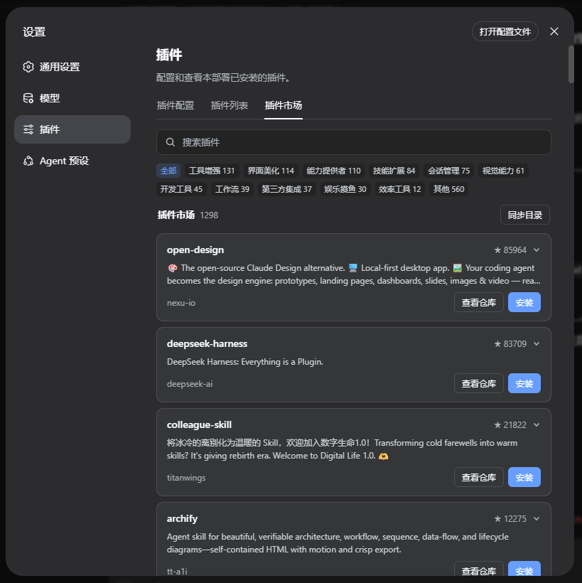

# DSH 插件市场 (dsh-plugin-market)

在 DeepSeek Harness Web UI 里发现、确认后一键安装社区插件；同时提供可公开访问的目录网站。

版本 **v0.3.0**。共享目录由 CI 生成 `registry.json`：公开站负责浏览与复制命令，DSH「设置 → 插件 → 插件市场」负责本机安装。

## 它做什么

| 面 | 入口 | 职责 |
|---|---|---|
| **设置内市场** | 设置 → 插件 →「插件市场」 | 搜索、分类、展开说明、确认后走官方 CLI 安装 / 卸载 |
| **公开目录站** | [`website/`](website/)（Vercel） | 浏览索引、⌘K 搜索、中英 / 亮暗主题、复制 `dsh plugin add`（**不在浏览器里安装**） |

## 快速开始

```bash
dsh plugin --profile web add github:chnjames/dsh-plugin-market
# 或
npx @deepseek-ai/dsh plugin --profile web add github:chnjames/dsh-plugin-market
```

安装后**重启** `dsh web`，打开 **设置 → 插件 → 插件市场**。



设置内卡片结构：

1. 标题行：名称 · 星标 · 展开  
2. 简介（最多两行）  
3. 底栏：已安装 / 作者 / 提示 · **查看仓库** · **安装**（安装前确认）

> Web profile 通常关闭配置热重载；改完插件后请重启再强刷页面。

更细的安装、本地 `file:` 路径、排障见 [INSTALL_DSH.md](INSTALL_DSH.md)；自测清单见 [INSTALL_TEST_GUIDE.md](INSTALL_TEST_GUIDE.md)。

卸载：

```bash
dsh plugin --profile web remove dsh-plugin-market
```

若日志里仍出现 `Web UI running at :3789`，说明旧 profile 里残留 `ui.webPort`：从 `cordis.patch.yml` 删掉该字段并重启（本机已不再提供独立 HTTP 面板）。

## 公开目录站

线上目录（默认）：[https://dsh-plugin-market.vercel.app](https://dsh-plugin-market.vercel.app)  
源码与本地 / Vercel 部署说明见 [`website/README.md`](website/README.md)。设计约束见 [`website/design.md`](website/design.md)。

能力摘要：

- 首页：安装命令终端、热门 / 分类 / 最近更新  
- 分类页：排序、分页（`?sort=` / `?page=`）  
- 详情页：复制安装命令、README 摘要  
- 顶栏：⌘K / Ctrl+K、中英、亮暗主题  

本机插件拉取目录的顺序：

1. `https://dsh-plugin-market.vercel.app/registry.json`  
2. jsDelivr（GitHub 文件）  
3. GitHub raw  
4. 包内 `lib/registry.snapshot.json`  
5. 以上都失败且 `catalog.fallbackToSearch: true` 时，才回退本机 GitHub / npm 搜索  

自定义域名时在 `cordis.patch.yml` 覆盖 `catalog.urls`。`/registry.json` 已开 CORS，供 DSH 插件拉取。

## 配置

```yaml
- insert:
    - id: plugin-market
      name: dsh-plugin-market
      config:
        catalog:
          fallbackToSearch: true
          # urls: ["https://your-domain/registry.json"]
        sources:
          github:
            enabled: true
            topic: "dsh-plugin"
          npm:
            enabled: true
            keyword: "dsh-plugin"
        cache:
          ttl: 21600
          autoRefresh: true
          refreshInterval: 21600
        ui:
          showRiskLevel: true
        install:
          defaultProfile: "web"
          confirmBeforeInstall: true
          # dshCommand: "npx @deepseek-ai/dsh"   # npx 运行 DSH 时取消注释
```

完整默认块见 [cordis.yml](cordis.yml)。

## Agent 工具

对话里可调用（需插件已加载）：

| 工具 | 用途 |
|---|---|
| `plugin_market_search` | 按关键词搜索目录 |
| `plugin_market_detail` | 查看单条插件详情 |
| `plugin_market_install` | 经官方 CLI 安装（带确认策略） |
| `plugin_market_list_installed` | 列出本机已装插件 |

## 架构

```
GitHub Actions ──► registry.json ──► Vercel 网站（浏览 / CORS）
                         └──► DSH host（sql.js 缓存 + Typert Remote）
                                    └──► 设置 → 插件 → 插件市场（本机安装）
```

| 层 | 说明 |
|---|---|
| Host | `PluginMarketService`（服务名 `pluginMarket`）；安装 Remote 方法为 **`installPlugin`**（不能叫 `install`） |
| Client | 设置 Tab；经嵌套 inject 调用 `remote.pluginMarket` |
| 分类 / 风险 | `src/utils/classifier.ts` 与 `shared/classifier.mjs` 须保持同步 |
| README 摘要 | Host 截断下发；UI 再摘成可读段落 |

深度审计与已知限制见 [AUDIT_REPORT.md](AUDIT_REPORT.md)。

## 开发

```bash
npm install
npm run build          # tsc + 复制 client + registry snapshot
npm run typecheck
npm run build:registry # 生成 website/public/registry.json

cd website && npm install && npm run dev   # http://localhost:3000
```

CI：`.github/workflows/ci.yml`（构建）、`registry.yml`（定时刷新目录）。

## 安全

- 目录只含公开元数据，不上传用户信息  
- 安装走官方 `dsh plugin add/remove`，不执行第三方安装脚本  
- `permissionLevel` 是文案启发式，默认「未评估」，**不是**权限审计  
- 只安装你信任的来源  

## 文档索引

| 文档 | 内容 |
|---|---|
| [INSTALL_DSH.md](INSTALL_DSH.md) | 安装、挂载、卸载、排障 |
| [INSTALL_TEST_GUIDE.md](INSTALL_TEST_GUIDE.md) | 自测清单 |
| [website/README.md](website/README.md) | 公开站本地开发与 Vercel |
| [website/design.md](website/design.md) | 公开站设计系统 |
| [AUDIT_REPORT.md](AUDIT_REPORT.md) | 架构与风险审计 |

## 许可证

MIT
